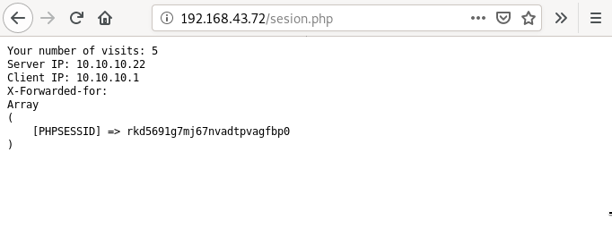

# Balanceador de carga
Para ello descarga este [fichero](https://fp.josedomingo.org/serviciosgs/u08/doc/haproxy/vagrant.zip), descomprímelo en un directorio y crea el escenario vagrant.

### Configurar y evaluar balanceo de carga con dos servidores Apache

Instala HAproxy en balanceador y configuralo de la siguiente manera:

Se instala el paquete haproxy:
~~~
root@balanceador:/home/vagrant# apt install haproxy
~~~

Se configura el fichero **/etc/haproxy/haproxy.cfg**:
~~~
global
    daemon
    maxconn 256
    user    haproxy
    group   haproxy
    log     127.0.0.1       local0
    log     127.0.0.1       local1  notice
defaults
    mode    http
    log     global
    timeout connect 5000ms
    timeout client  50000ms
    timeout server  50000ms
listen granja_cda
    bind 192.168.43.72:80
    mode http
    stats enable
    stats auth  cda:cda
    balance roundrobin
    server uno 10.10.10.11:80 maxconn 128
    server dos 10.10.10.22:80 maxconn 128
~~~

**Tarea 1: Entrega capturas de pantalla que el balanceador está funcionando.**

**Tarea 2: Entrega una captura de pantalla donde se vea la página web de estadísticas de haproxy (abrir en un navegador web la URL http://172.22.x.x/haproxy?stats, pedirá un usuario y un password, ambos cda).**

**Tarea 3: Desde uno de los servidores (apache1 ó apache2), verificar los logs del servidor Apache. En todos los casos debería figurar como única dirección IP cliente la IP interna de la máquina balanceador 10.10.10.1. ¿Por qué?**

~~~
vagrant@apache2:~$ sudo tail /var/log/apache2/access.log
10.10.10.1 - - [21/Feb/2020:22:11:14 +0000] "GET / HTTP/1.1" 200 436 "-" "Mozilla/5.0 (X11; Linux x86_64; rv:68.0) Gecko/20100101 Firefox/68.0"
10.10.10.1 - - [21/Feb/2020:22:11:15 +0000] "GET / HTTP/1.1" 200 436 "-" "Mozilla/5.0 (X11; Linux x86_64; rv:68.0) Gecko/20100101 Firefox/68.0"
10.10.10.1 - - [21/Feb/2020:22:11:16 +0000] "GET / HTTP/1.1" 200 436 "-" "Mozilla/5.0 (X11; Linux x86_64; rv:68.0) Gecko/20100101 Firefox/68.0"
10.10.10.1 - - [21/Feb/2020:23:21:31 +0000] "GET / HTTP/1.1" 200 436 "-" "Mozilla/5.0 (X11; Linux x86_64; rv:68.0) Gecko/20100101 Firefox/68.0"
10.10.10.1 - - [21/Feb/2020:23:21:33 +0000] "GET / HTTP/1.1" 200 436 "-" "Mozilla/5.0 (X11; Linux x86_64; rv:68.0) Gecko/20100101 Firefox/68.0"
10.10.10.1 - - [21/Feb/2020:23:21:34 +0000] "GET / HTTP/1.1" 200 436 "-" "Mozilla/5.0 (X11; Linux x86_64; rv:68.0) Gecko/20100101 Firefox/68.0"
10.10.10.1 - - [21/Feb/2020:23:29:41 +0000] "GET / HTTP/1.1" 200 436 "-" "Mozilla/5.0 (X11; Linux x86_64; rv:68.0) Gecko/20100101 Firefox/68.0"
10.10.10.1 - - [21/Feb/2020:23:29:43 +0000] "GET / HTTP/1.1" 200 436 "-" "Mozilla/5.0 (X11; Linux x86_64; rv:68.0) Gecko/20100101 Firefox/68.0"
10.10.10.1 - - [21/Feb/2020:23:29:44 +0000] "GET / HTTP/1.1" 200 436 "-" "Mozilla/5.0 (X11; Linux x86_64; rv:68.0) Gecko/20100101 Firefox/68.0"
10.10.10.1 - - [21/Feb/2020:23:32:46 +0000] "GET / HTTP/1.1" 200 436 "-" "Mozilla/5.0 (X11; Linux x86_64; rv:68.0) Gecko/20100101 Firefox/68.0"
~~~

### Configurar la persistencia de conexiones Web (sticky sessions)
En los servidores internos hay una aplicación PHP para trabajar con sesiones, puedes encontrar el fichero sesion.php con el siguiente contenido:
~~~
<?php
     header('Content-Type: text/plain');
     session_start();
     if(!isset($_SESSION['visit']))
     {
             echo "This is the first time you're visiting this server";
             $_SESSION['visit'] = 0;
     }
     else
             echo "Your number of visits: ".$_SESSION['visit'];             

     $_SESSION['visit']++;              

     echo "\nServer IP: ".$_SERVER['SERVER_ADDR'];
     echo "\nClient IP: ".$_SERVER['REMOTE_ADDR'];
     echo "\nX-Forwarded-for: ".$_SERVER['HTTP_X_FORWARDED_FOR']."\n";
     print_r($_COOKIE);
?>
~~~

Vamos a añadir las opciones de persistencia de conexiones HTTP (sticky cookies) al fichero de configuración::

Contenido a incluir: (añadidos marcados con <- aquí)::
~~~
global
     daemon
     maxconn 256
     user    haproxy
     group   haproxy
     log     127.0.0.1       local0
     log     127.0.0.1       local1  notice         

 defaults
     mode    http
     log     global
     timeout connect 10000ms
     timeout client  50000ms
     timeout server  50000ms            

 listen granja_cda 
     bind 172.22.x.x:80 #aquí pon la dirección ip del balanceador
     mode http
     stats enable
     stats auth  cda:cda
     balance roundrobin
     cookie PHPSESSID prefix                               # <- aquí
     server uno 10.10.10.11:80 cookie EL_UNO maxconn 128   # <- aquí
     server dos 10.10.10.22:80 cookie EL_DOS maxconn 128   # <- aquí
~~~

El parámetro cookie especifica el nombre de la cookie que se usa como identificador único de la sesión del cliente (en el caso de aplicaciones web PHP se suele utilizar por defecto el nombre PHPSESSID). Para cada “servidor real” se especifica una etiqueta identificativa exclusiva mediante el parámetro cookie. Con esa información HAproxy reescribirá las cabeceras HTTP de peticiones y respuestas para seguir la pista de las sesiones establecidas en cada “servidor real” usando el nombre de cookie especificado (PHPSESSID):

    conexión cliente -> balanceador HAproxy : cookie original + etiqueta de servidor
    conexión balanceador HAproxy -> servidor : cookie original

Reiniciamos el balanceador y realizamos las siguientes acciones:

    desde el navegador web acceder varias veces a la URL http://172.22.x.x/sesion.php(comprobar el incremento del contador [variable de sesión])

    acceder la misma URL desde el navegador en modo texto lynx (o desde una pestaña de “incógnito” del Navegador para forzar la creación de una nueva sesión)::

      cliente:~# lynx -accept-all-cookies http://172.22.x.x/sesion.php

**Verificar la estructura y valores de las cookies PHPSESSID intercambiadas. En la primera respuesta HTTP (inicio de sesión), se establece su valor con un parámetro HTTP SetCookie en la cabecera de la respuesta. Las sucesivas peticiones del cliente incluyen el valor de esa cookie (parámetro HTTP Cookie en la cabecera de las peticiones)**

Desde lynx:
~~~
This is the first time you're visiting this server
Server IP: 10.10.10.11
Client IP: 10.10.10.1
X-Forwarded-for:
Array
(
)
~~~

# Proxy inverso
Para hacer esta práctica puedes utilizar el escenario del ejercicio anterior.

En este caso queremos instalar dos servidores web en el apache1 y en apache2, estos servidores deben servir una web completa (con hoja de estilo, imágenes,…) busca alguna plantilla (debe tener algunas páginas html para probar los enlaces).

Configura en el ordenador balanceador (tienes que detener haproxy) un proxy inverso para acceder a las aplicaciones de dos formas distintas:
~~~
root@balanceador:/etc/haproxy# systemctl stop haproxy
~~~

Se descarga nginx:
~~~
root@balanceador:/etc/haproxy# apt install nginx
~~~

**Para que se acceda a la primera aplicación con la URL www.app1.org y a la segunda aplicación con la URL www.app2.org.**

- En apache1/apache2:
Para que se escuchen las máquinas apache1 y apache2 por el puerto 8080 hay que configurar **/etc/apache2/sites-available/000-default.conf** de la siguiente forma:
~~~
<VirtualHost *:8080>
~~~

Y también el fichero **/etc/apache2/ports.conf**:
~~~
Listen 8080
~~~

Se reinician ambos servicios se Apache2:
~~~
vagrant@apache1:~$ sudo systemctl restart apache2.service 
~~~

- En el balanceador:
Se configura el virtualhost **/etc/nginx/conf.d/app1.conf** añadiendo el proxy inverso de cada máquina:
~~~
upstream backend {
    server 10.10.10.11:8080;
    keepalive 64;
}

server {
    listen 80;
    server_name www.app1.org;
    location / {
        proxy_set_header X-Forwarded-Host $host;
        proxy_set_header X-Forwarded-Server $host;
        proxy_set_header X-Forwarded-For $proxy_add_x_forwarded_for;
        proxy_pass http://backend;
        proxy_http_version 1.1;
        proxy_pass_request_headers on;
        proxy_set_header Connection "keep-alive";
        proxy_store off;
    }
}
~~~

Y **/etc/nginx/conf.d/app2.conf**:
~~~
upstream backend2 {
    server 10.10.10.22:8080;
    keepalive 64;
}

server {
    listen 80;
    server_name www.app2.org;
    location / {
        proxy_set_header X-Forwarded-Host $host;
        proxy_set_header X-Forwarded-Server $host;
        proxy_set_header X-Forwarded-For $proxy_add_x_forwarded_for;
        proxy_pass http://backend2;
        proxy_http_version 1.1;
        proxy_pass_request_headers on;
        proxy_set_header Connection "keep-alive";
        proxy_store off;
    }
}
~~~

Por último, se reinicia el servicio de nginx:
~~~
vagrant@balanceador:/etc/nginx/conf.d$ sudo systemctl restart nginx.service 
~~~

> Prueba:

**Para que se acceda a la primera aplicación con la URL www.servidor.org\app1 y a la segunda aplicación con la URL www.servidor.org\app2.**
Para este ejercicio solo se necesita configurar un virtualhost con la siguiente configuración:
~~~
server {
	listen 80;
	server_name www.servidor.org;

	location /app1 {
		proxy_set_header X-Forwarded-Host $host;
		proxy_set_header X-Forwarded-Server $host;
		proxy_set_header X-Forwarded-For $proxy_add_x_forwarded_for;
		proxy_pass http://10.10.10.11:8080/;
		proxy_http_version 1.1;
		proxy_pass_request_headers on;
		proxy_set_header Connection "keep-alive";
		proxy_store off;
	}
    location /app2 {
        proxy_set_header X-Forwarded-Host $host;
        proxy_set_header X-Forwarded-Server $host;
        proxy_set_header X-Forwarded-For $proxy_add_x_forwarded_for;
        proxy_pass http://10.10.10.22:8080/;
        proxy_http_version 1.1;
        proxy_pass_request_headers on;
        proxy_set_header Connection "keep-alive";
        proxy_store off;
    }
}
~~~

Y se reinicia:
~~~
vagrant@balanceador:/etc/nginx/conf.d$ sudo systemctl restart nginx.service 
~~~

> Prueba

